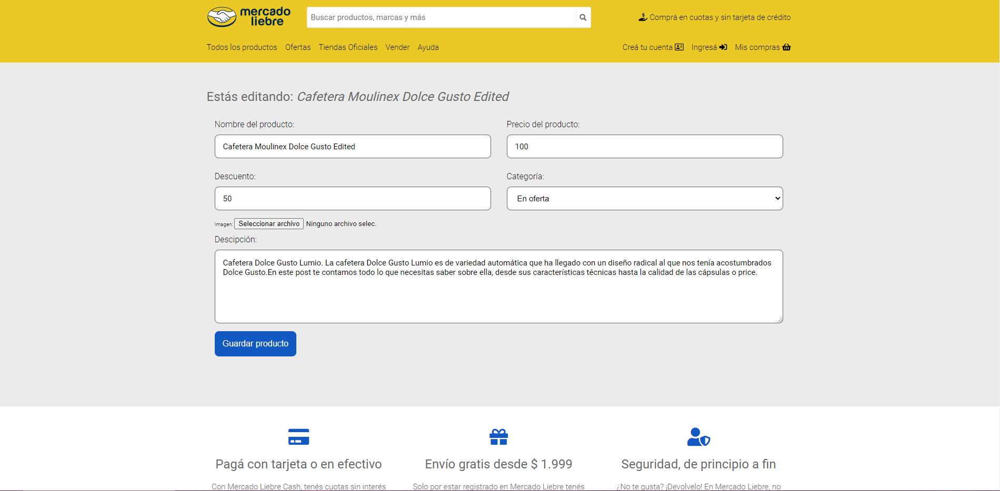

 

 <h1 align="center">e-commerce MERCADOLIBRE</h1>

 


## table of Contents

* [General information](#General-information)
* [Technologies](#Technologies)
* [Setting](#Settings)
* [Introduction](#Introduction)
* [Next challenges](#Next-challenges)


## General information

This project was created with the aim of using the knowledge learned as a team and developing the technologies described here.
	


## Technologies

The project is created with:

   * Nodejs:  16.20.0 [Nodejs](https://nodejs.org/en/download)
   * Express Generator 4.16.0 [Express Generator](https://www.npmjs.com/package/express-generator)
   * ejs: 2.6.1 [ejs](https://ejs.co/)
   * express: 4.16.1 [express](https://expressjs.com/es/)
   * http-errors: 1.6.3 [http-errors](https://www.npmjs.com/package/http-errors)
   * method-override: 3.0.0 [method-override](https://www.npmjs.com/package/method-override)
   * morgan: 1.9.1 [morgan](https://www.npmjs.com/package/morgan)
   * multer: 1.4.2 [multer](https://www.npmjs.com/package/multer)
   * nodemon: 2.0.1 [nodemon](https://www.npmjs.com/package/nodemon)
	


## Settings
To run this project, install it locally using npm:


1- [Install nodejs](https://nodejs.org/en/download)

2- [Isntall npm](https://www.npmjs.com/)

```
3- git clone: https://github.com/adrianpuche12/App_e_commerce_proyect_digital-house.git
4- $ cd App_e_commerce_proyect_digital-house
5- $ npm init
6- $npm start

```


 # Introduction

Este proyecto fue creado usando también las siguientes herramientas:


* Design Thinking
* scrum methodologies
* Springs
* Canvas model


##### Imagen to Home Page

 


##### Imagen to PAGE LINDING PRODUCT

 


##### image product edit


 


 
 # Next challenges


My next challenge are:

 * help page (The client can get all the help they need by interacting with pre-established responses)

 * shopping cart development (The client has the possibility of saving their products.)

 * mobile menu development (hamburger menu development in mobile mode)
